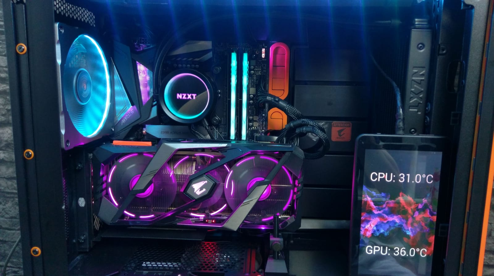

# Casemod Temperature Monitor
This is a small and rudimentary project for a display within your computer case that displays CPU and GPU temperature.

## Usage
### General
This Application works by periodically fetching temperatures from the system and sending them to an android device via network.
The android device listens for udp on port 8080 .

### Setup
#### Obligatory configuration file
You need to create a `configuration.json` in the same directory as the executable:
```json
// configuration.json
{
  "device_hostname": "hostname_of_the_android_device",
  "port": 8080,
  "update_in_ms": 1000,
  "background_image_path": "Path\\to\\your\\custom\\app\\background"
}

```
The last configuration string is optional and can be left out. The app will still work as expected.

#### Optional layout configuration
Create a file called `layout.json` in the same directory as the executable:
```json
// layout.json
{
    "gpu_y_from_bottom": 150,
    "cpu_y_from_top": 150,
    "text_colour":  "AARRGGBB"
}
```
Note: `text_colour` is a hex colourvalue but leave out the `#`.
## Pictures


## Notices
#### Third party libraries
- MonitorPCModule\MonitorPCModule\external\OpenHardwareMonitorLib.dll : [Website](https://openhardwaremonitor.org/), [Sourcecode](https://github.com/openhardwaremonitor/openhardwaremonitor)

#### License 
This project is licensed under the [MIT license](https://opensource.org/licenses/MIT). 
In addition to that, if you redistribute or modify this code in compiled or non compiled state, you have to link to the origin of the code meaning this repository.
